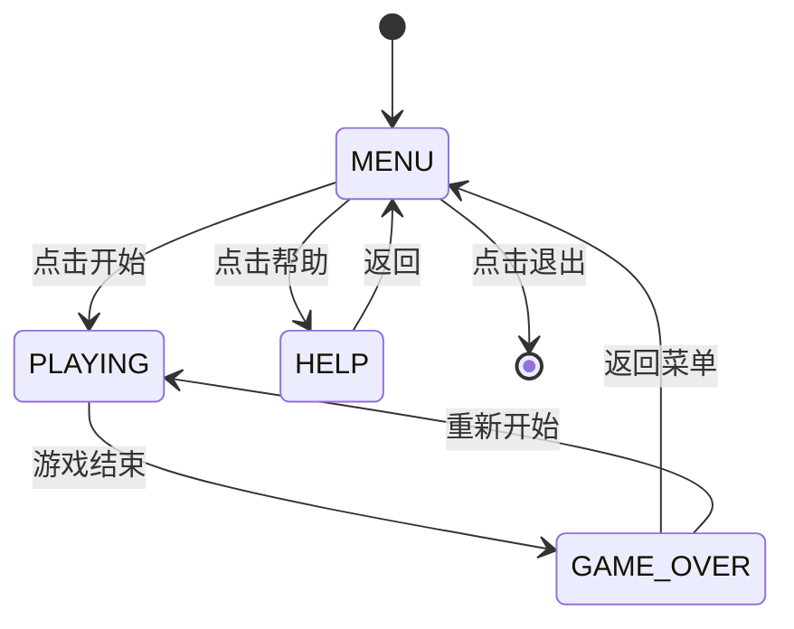

## 产品概述

一款面向儿童的高分辨率垃圾分类教育小游戏，通过有趣的拖拽交互方式帮助孩子学习垃圾分类知识。

## 核心功能

- **开始菜单**: 包含开始游戏、帮助说明、退出游戏三个选项，采用童趣风格的界面设计
- **帮助说明**: 展示游戏规则、操作方法和四种垃圾分类知识
- **游戏主界面**: 
- 屏幕上方显示当前垃圾的 emoji 图标和名称
- 屏幕下方放置 4 个分类垃圾桶（可回收垃圾、有害垃圾、厨余垃圾、其他垃圾）
- 玩家通过鼠标拖拽垃圾到正确的垃圾桶
- 每个垃圾有 10 秒时间限制，显示倒计时进度条
- **得分机制**: 分类正确加分，分类错误扣分，实时显示当前得分
- **垃圾物品**: 涵盖 50 种不同的垃圾物品，均匀分布在四个类别中
- **视觉风格**: 采用 emoji 风格图标、明亮柔和的配色、圆润的 UI 元素，适合儿童使用

## 技术栈

- **语言**: Python 3
- **游戏框架**: Pygame
- **代码结构**: 单文件 main.py，开头定义常量和工具函数，主逻辑分函数实现

## 实现方案

### 核心策略

采用状态机模式管理游戏流程（菜单、帮助、游戏中、结束），使用 Pygame 的事件系统处理鼠标拖拽交互。参考现有 duck_game 项目的代码模式，包括字体加载、音效生成、按钮组件等。

### 关键技术决策

1. **拖拽实现**: 使用 MOUSEBUTTONDOWN/MOUSEMOTION/MOUSEBUTTONUP 事件组合实现拖拽，跟踪鼠标位置并更新垃圾图标位置
2. **垃圾数据结构**: 使用字典列表存储 50 种垃圾的名称、emoji 图标和所属类别
3. **碰撞检测**: 使用 pygame.Rect 的 colliderect 方法检测垃圾是否拖入垃圾桶区域
4. **倒计时**: 使用 pygame.time.get_ticks() 实现 10 秒计时器，超时自动跳到下一个垃圾

### 性能考虑

- 预渲染静态背景和垃圾桶图形，避免每帧重绘
- 使用 Surface 缓存 emoji 文字渲染结果
- 限制帧率为 60 FPS

## 技术架构

### 状态机设计



### 模块划分

1. **常量定义**: 屏幕尺寸、颜色、状态常量、垃圾数据
2. **工具函数**: 字体加载、音效生成、绘图辅助函数
3. **Button 类**: 可复用的按钮组件
4. **MenuBackground 类**: 动态菜单背景
5. **Game 类**: 主游戏逻辑，包含状态管理、拖拽处理、碰撞检测、得分计算

### 数据流

用户拖拽操作 -> 碰撞检测 -> 判断分类正确性 -> 更新得分 -> 生成下一个垃圾 -> 渲染更新

## 实现要点

### 代码组织

参考 duck_game/main.py 的结构，按以下顺序组织代码：

1. 文件头注释和导入
2. Pygame 初始化和屏幕设置
3. 颜色常量和配置
4. 垃圾数据定义（50 种垃圾）
5. 音效生成函数
6. 字体加载函数
7. 绘图工具函数
8. Button 和 MenuBackground 类
9. Game 主类
10. 主入口

### 垃圾数据设计

四个类别各 12-13 种垃圾，共 50 种：

- 可回收垃圾（蓝色桶）: 报纸、塑料瓶、易拉罐等
- 有害垃圾（红色桶）: 电池、灯泡、过期药品等
- 厨余垃圾（绿色桶）: 果皮、剩饭、蛋壳等
- 其他垃圾（灰色桶）: 餐巾纸、烟蒂、陶瓷碎片等

### 拖拽交互实现

```
MOUSEBUTTONDOWN -> 检测点击垃圾区域 -> 开始拖拽
MOUSEMOTION -> 更新垃圾位置跟随鼠标
MOUSEBUTTONUP -> 检测释放位置 -> 判断是否在垃圾桶内 -> 计分
```

### 视觉效果

- 菜单背景: 柔和渐变 + 浮动装饰圆形
- 垃圾桶: 卡通风格，带有类别图标和标签
- 垃圾图标: 大号 emoji + 文字名称
- 按钮: 药丸形状，带悬停效果和阴影
- 进度条: 圆角条形，颜色随时间变化（绿->黄->红）

## 目录结构

```
/Users/wondery/Work/ghx/
└── main.py  # [NEW] 垃圾分类小游戏主程序。包含完整游戏逻辑：常量定义（屏幕尺寸、颜色、50种垃圾数据）、工具函数（字体加载、音效生成、绘图辅助）、Button类（可复用按钮组件）、MenuBackground类（动态背景）、Game类（状态机管理、拖拽交互、碰撞检测、得分计算、界面渲染）。代码结构清晰，开头定义常量和工具函数，主逻辑分函数实现。
```

## 关键代码结构

### 垃圾数据接口

```python
# 垃圾类别常量
CATEGORY_RECYCLABLE = "recyclable"    # 可回收垃圾
CATEGORY_HARMFUL = "harmful"          # 有害垃圾
CATEGORY_KITCHEN = "kitchen"          # 厨余垃圾
CATEGORY_OTHER = "other"              # 其他垃圾

# 垃圾数据结构
TRASH_DATA = [
    {"name": "报纸", "emoji": "📰", "category": CATEGORY_RECYCLABLE},
    {"name": "废电池", "emoji": "🔋", "category": CATEGORY_HARMFUL},
    # ... 共50种
]

# 垃圾桶数据结构
BINS = [
    {"category": CATEGORY_RECYCLABLE, "name": "可回收", "color": BLUE, "emoji": "♻️"},
    {"category": CATEGORY_HARMFUL, "name": "有害", "color": RED, "emoji": "☠️"},
    {"category": CATEGORY_KITCHEN, "name": "厨余", "color": GREEN, "emoji": "🍂"},
    {"category": CATEGORY_OTHER, "name": "其他", "color": GRAY, "emoji": "🗑️"},
]
```

## 设计风格

采用童趣卡通风格，明亮活泼的配色方案，适合儿童使用。使用 Pygame 原生绘图实现圆润的 UI 元素和柔和的视觉效果。

## 页面设计

### 1. 开始菜单页面

- **顶部区域**: 游戏标题「垃圾分类小游戏」，采用彩色文字，每个字不同颜色，带轻微浮动动画
- **中部区域**: 可爱的垃圾桶卡通图案，四个垃圾桶排列展示
- **按钮区域**: 三个药丸形按钮垂直排列 - 开始游戏（绿色）、游戏帮助（蓝色）、退出游戏（灰色），带悬停放大效果
- **背景**: 柔和渐变背景 + 浮动的彩色圆形装饰

### 2. 帮助说明页面

- **卡片容器**: 白色圆角卡片，带柔和阴影
- **标题**: 「游戏帮助」居中显示
- **内容分区**: 
- 操作说明：鼠标拖拽垃圾到对应垃圾桶
- 分类知识：四种垃圾桶的颜色和对应垃圾类型图示
- 计分规则：正确+10分，错误-5分
- **返回按钮**: 底部蓝色药丸按钮

### 3. 游戏主界面

- **顶部信息栏**: 显示当前得分、剩余垃圾数量
- **垃圾展示区（上半部分）**: 
- 大号 emoji 图标（约 120px）
- 垃圾名称文字标签
- 10秒倒计时进度条（颜色随时间变化：绿->黄->红）
- **垃圾桶区域（下半部分）**: 
- 四个卡通垃圾桶水平排列
- 每个垃圾桶带有类别图标、名称标签
- 拖拽进入时有高亮反馈效果
- **得分动画**: 正确显示绿色+10浮动文字，错误显示红色-5浮动文字

### 4. 游戏结束页面

- **卡片容器**: 白色圆角卡片居中
- **标题**: 「游戏结束」
- **得分展示**: 最终得分大号显示
- **评价文字**: 根据得分给出鼓励性评语
- **按钮**: 重新开始（绿色）、返回菜单（蓝色）